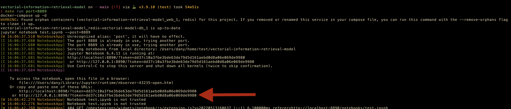
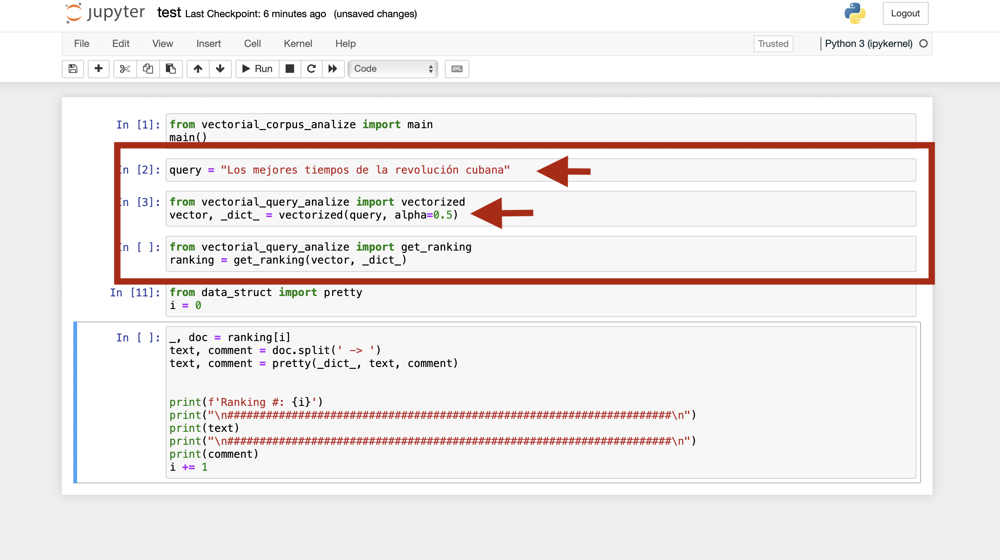
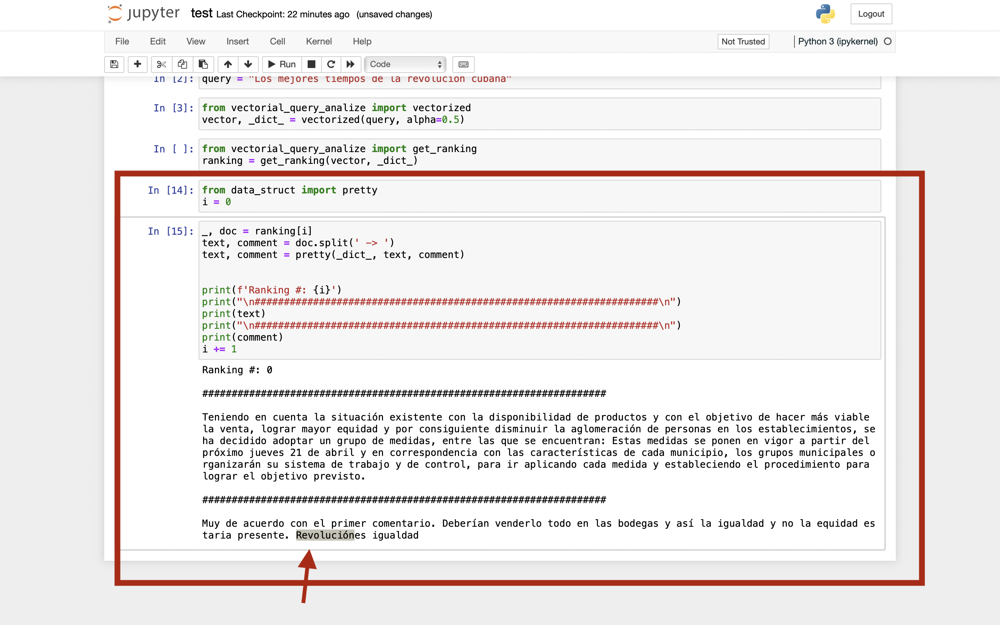

## Vectorial Model to the Information Retrieval

Este proyecto es una implementación del modelo vectorial para la recuperación de información sobre el corpus de los comentarios (en español)
de varias publicaciones de las distintas redes sociales

    La ejecución solo depende de python > 3.6, pip, docker-compose y algún navegador

## Ejecución

El proyecto cuenta con un **Makefile** con dos reglas principales _build_ y _run_, la primera para instalar el resto de dependencias y
construir el container con las configuraciones de la _db_. Antes de ejecutar este comando se recomiendo crea un _environment python_,
para lo que recomendamos [pipenv](https://pipenv.pypa.io/en/latest/install/).
El comando _build_ espera un parámetro **port** el cual
es el puerto por el container de docker expondrá el servicio de _db_ y por el que el modelo interactuara dicho servicio.

    $> make build port=6379

Una vez resueltas todas las dependencias necesarias use el comando _run_ para levantar un server de _jupyter notebook_ que mostrar el
código mínimo para interactuar con el modelo, y recuperar los distintos resultados. Este comando espera un parámetro **port** el cual
es el puerto por el que se expondrá el servidor de **jupyter**

    $> make run port=8888

Si todo va bien la salida debe mostrar algo parecido a lo siguiente:

Donde copiando la url señalada y pegandola en el navegador directamente podrá acceder a código básico interactivo

## Código Interactivo

Una acceda al _jupyter notebook_, el código inicial que podrá ver se puede separa en tres bloques principales según su funcionalidad

### Procesamiento del Corpus

En estas celdas del notebook se carga el corpus de la fuente, se le aplican las distintas técnicas del procesamiento de texto para
finalmente persistir todos estos cálculos realizados en la _db_. Si ya existieran los texto en la _db_ estas lineas no realizan ninguna operación.

### Procesamiento del Consulta

Esta sección es mucho más interactiva y rápida que la anterior, aquí puede modificar la variable `query` para decirle al modelo
sobre que tema desea buscar, ademas puede modificar el parámetro `alpha` y de esta manera ver cual valor genera mejor ranking

### Inspección del Ranking

Luego en con estas lineas finales se puede iterar relativamente cómodo por toda la lista de documentos y ver cual fue el ranking propuesto. Además
se ofrece la función pretty para resaltar en los documentos los términos que se consideraron relevantes para la consulta en cuestión

<!--
Implementation with Python of vectorial model to information retrieval. Over the corpus of the comment in social nets -->
